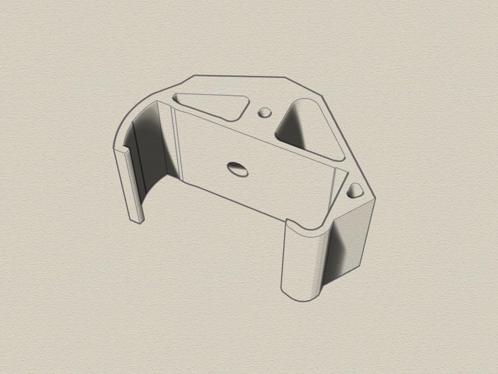
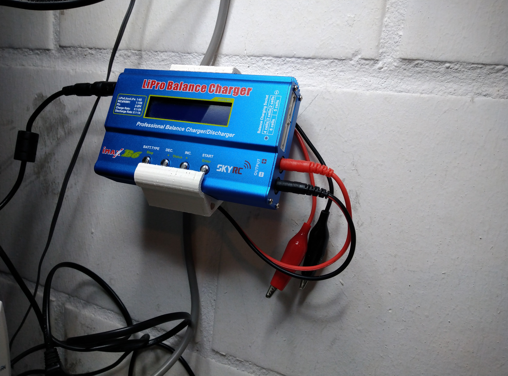

# iMax-B6-wallmount
3D printable wallmount for iMax B6 battery charger (created with Rhino 6).

#### Wallmount

The wallmount for the iMax B6 battery charger consist of a single part that is srewed to a wall.

#### Requirements:
* 3D printer 
* Filament of your choice
* Screw and Dowel

#### View
 
 
